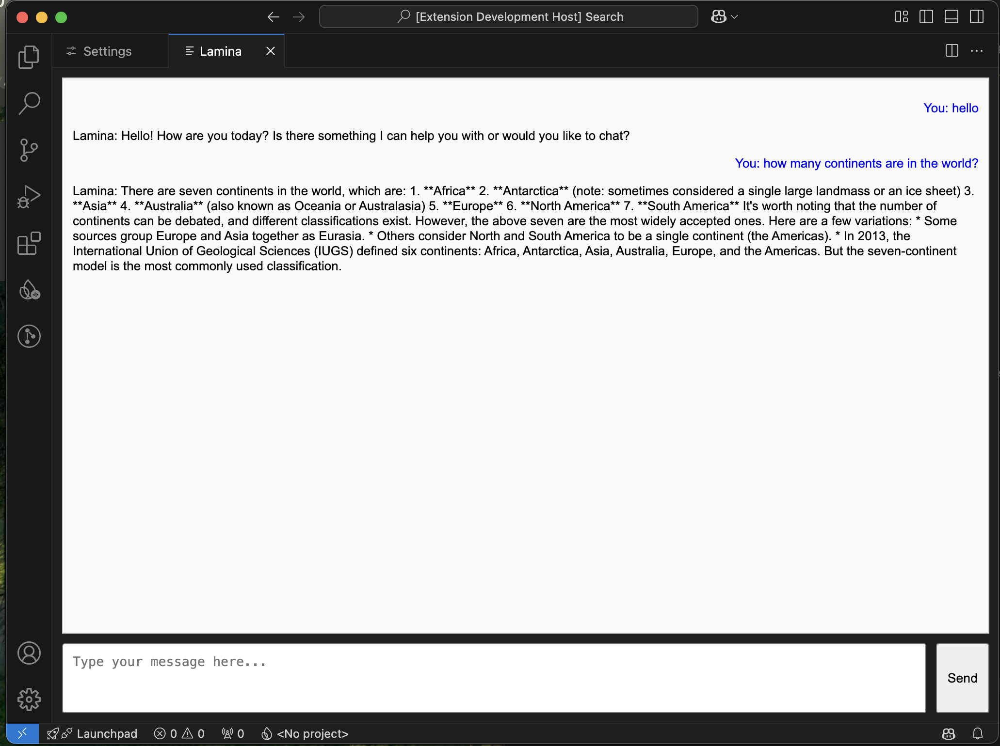
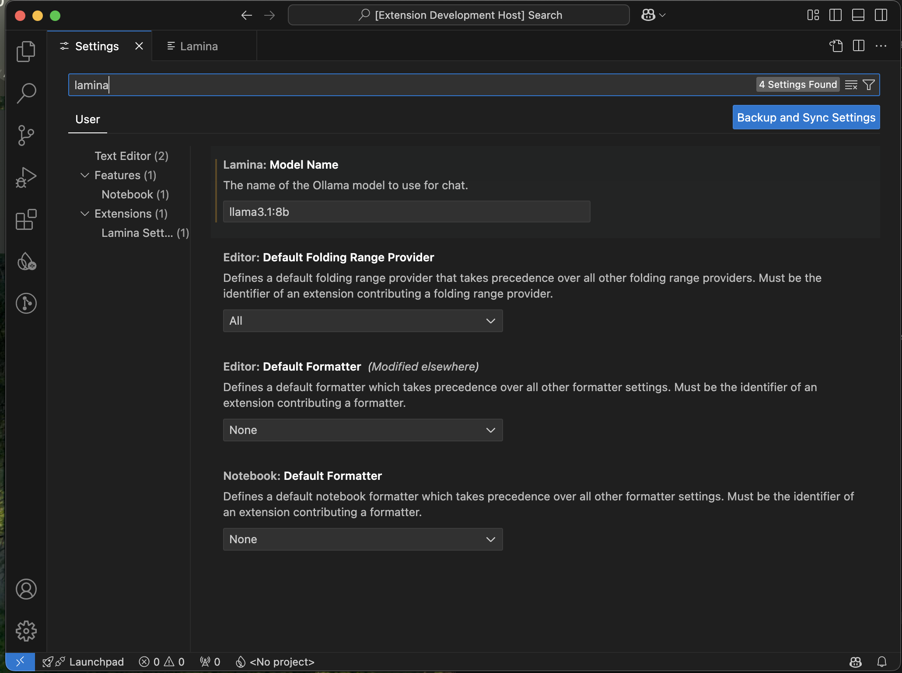

# Lamina

Lamina is a VS Code extension that provides a chat interface to interact with Ollama models, offering an easy way to query AI models like `llama3.1` and get responses directly inside your code editor.

## Features

- **Chat Interface**: Open a dedicated chat panel within VS Code to communicate with AI models like `llama3.1`.
- **Customizable Model**: Easily switch between different models (e.g., `llama3.1:8b`) through VS Code settings.
- **Real-time Responses**: Stream responses from the model in real-time.
- **Message History**: Send and receive multiple messages while maintaining a conversation flow.

## Requirements

- [Ollama](https://ollama.com) should be installed and properly set up in your system to use the extension.
- This extension communicates with Ollama's chat models. Ensure that the desired models are available on your machine.

## Extension Settings

This extension contributes the following settings:

- `lamina.modelName`: Set the model name to use for the chat interface. Default is `"llama3.1"`. Change it to models like `"llama3.1:8b"` depending on your setup.
  - Example: `"lamina.modelName": "llama3.1:8b"`

To set the model name:
1. Open VS Code settings.
2. Search for `Lamina`.
3. Set the desired model name.
